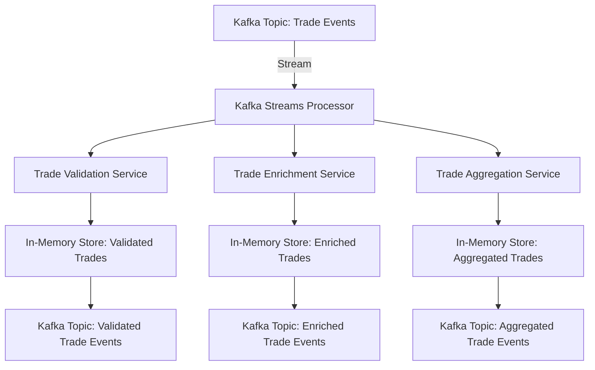

# System Patterns

## System Architecture
The architecture is designed to be event-driven and microservices-based, leveraging Kafka Streams for real-time processing of trade events. All computations are performed in-memory to ensure high performance and low latency.

### Components
1. **Kafka**: Used for event streaming and message brokering.
2. **Kafka Streams**: Processes input events in real-time.
3. **Microservices**: Each microservice handles specific parts of the trade flow.
4. **In-Memory Data Stores**: Used for temporary data storage and state management.

### Architecture Diagram

## Key Technical Decisions
1. **Event-Driven Architecture**: Chosen for its scalability and ability to handle real-time data processing.
2. **In-Memory Computations**: Ensures high performance and low latency by avoiding traditional databases.
3. **Microservices**: Provides modularity, making the system easier to maintain and scale.

## Design Patterns
1. **Event Sourcing**: Captures all changes to the state as a sequence of events.
2. **CQRS (Command Query Responsibility Segregation)**: Separates read and write operations to optimize performance.
3. **Circuit Breaker**: Prevents cascading failures by stopping the flow of requests to a failing service.

## Component Relationships
- **Kafka Streams Processor**: Consumes events from the Kafka topic and routes them to the appropriate microservices.
- **Trade Validation Service**: Validates incoming trade events and stores validated trades in an in-memory store.
- **Trade Enrichment Service**: Enriches validated trade events and stores enriched trades in an in-memory store.
- **Trade Aggregation Service**: Aggregates enriched trade events and stores aggregated trades in an in-memory store.

## Input Formats
The system supports multiple input formats for trade events:
- **FIX Messages**: Financial Information eXchange (FIX) protocol messages.
- **XML**: Extensible Markup Language (XML) formatted trade events.
- **JSON**: JavaScript Object Notation (JSON) formatted trade events.

## Scalability
The system is designed to scale horizontally by adding more instances of microservices. Kafka's partitioning and replication features ensure that the system can handle increasing volumes of trade events without performance degradation.

## Fault Tolerance
The architecture includes fault-tolerant mechanisms such as Kafka's replication and the Circuit Breaker pattern to ensure system reliability and availability.

## Monitoring and Logging
- **Monitoring**: Use tools like Prometheus and Grafana to monitor system performance and health.
- **Logging**: Implement centralized logging using tools like ELK Stack (Elasticsearch, Logstash, Kibana) to collect and analyze logs from all microservices.